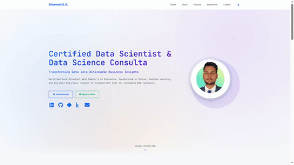

<h1 align="center">Portfolio Website</h1>

<p align="center"><strong>Static portfolio website built with vanilla JavaScript and modular CSS architecture</strong></p>

<p align="center">


<br>

<a href="LICENSE"></a>


<br>


</p>

## Overview

Static portfolio website built with vanilla JavaScript ES6 modules. No build
tools or bundlers required. Implements component-based architecture with dynamic
nav/footer loading, theme switching, and Intersection Observer animations.
Deployed on GitHub Pages.

## Key Features

- Animations: Typing effects, scroll-triggered fade-ins, directional slides,
  staggered transitions, and interactive hover effects
- Component System: Dynamic nav/footer loading, project filtering with keyboard
  navigation, infinite scroll carousels
- Theme Switching: Light/dark mode with localStorage persistence and FOUC
  prevention
- Document Viewers: Custom PDF viewer with zoom controls, certificate viewer
  with URL routing
- Performance: RequestAnimationFrame scroll optimization, lazy loading, passive
  listeners, resource hints
- Accessibility: Keyboard navigation, ARIA attributes, semantic HTML,
  prefers-reduced-motion support
- SEO: XML sitemap, robots.txt, Open Graph tags
- Security: External link protection, CORS restrictions, non-downloadable
  viewers
- Analytics: Google Analytics GA4 with event tracking & more.....

### Demo

<div align="center">

|                                                           Homepage                                                            |
| :---------------------------------------------------------------------------------------------------------------------------: |
|                                                                                         |
| Homepage featuring dynamic typing animation, infinite scroll carousels for skills and projects, and smooth reveal animations. |

</div>

## Development Setup

**Prerequisites:** Python 3.10+, Node.js 18.0+, npm 9.0+

```bash
# Clone repository
git clone https://github.com/dhaneshbb/dhaneshbb.github.io.git
cd dhaneshbb.github.io/v0.0.2

# Install dev dependencies
npm install

# Start local server
npm run dev
# Navigate to http://localhost:8000

# Run linters
npm run lint

# Auto-fix issues
npm run lint:fix

# Format code
npm run format
```

## License

Copyright © 2025 Dhanesh B.B. All Rights Reserved.

UNLICENSED - Code viewable for educational purposes only. No copying,
redistribution, or commercial use permitted.

## Links

- Live Site: [https://dhaneshbb.github.io](https://dhaneshbb.github.io)
- Repository:
  [https://github.com/dhaneshbb/dhaneshbb.github.io](https://github.com/dhaneshbb/dhaneshbb.github.io)
